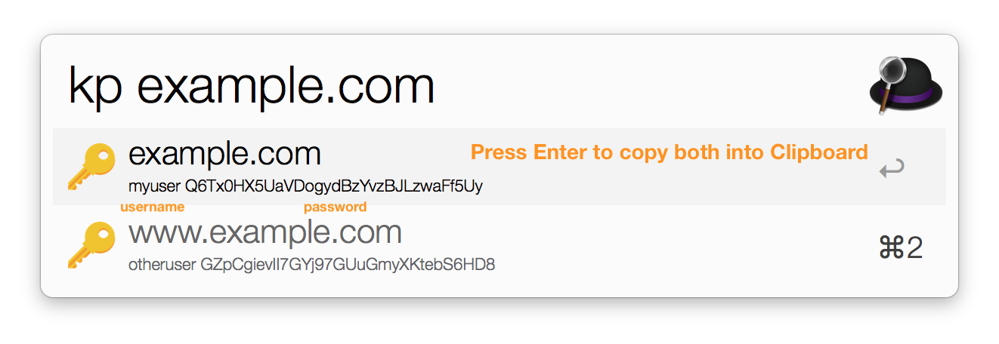
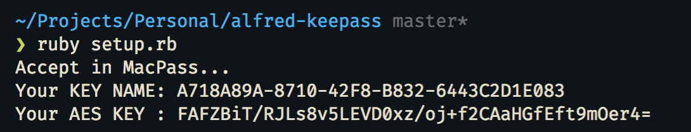
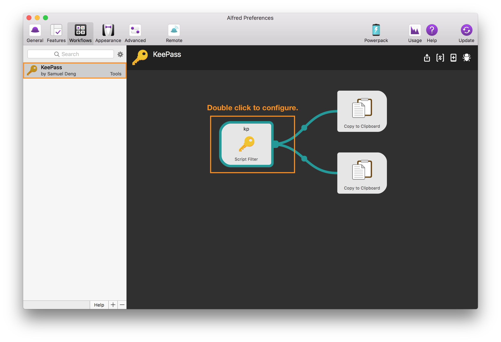
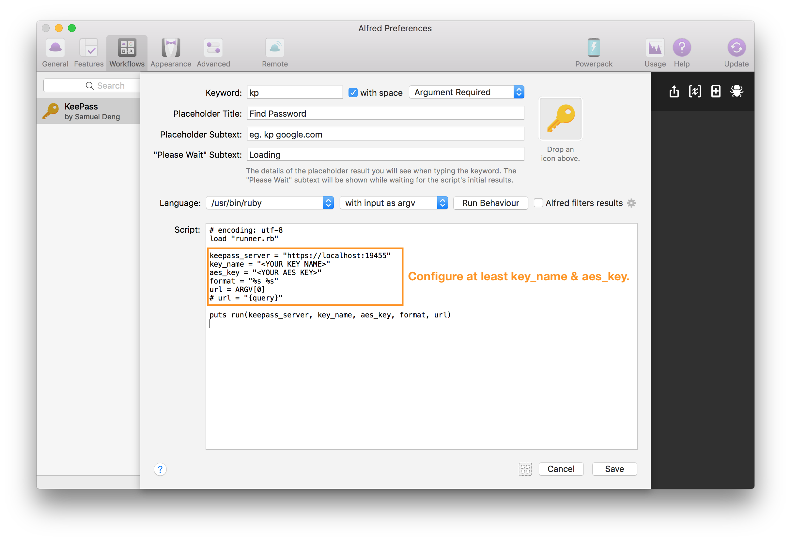

# Alfred-Keepass
Alfred-Keepass is a Alfred Workflow based on Ruby Script to lookup KeePass entries. 
[Download Here](https://github.com/vabatta/alfred-keepass/releases)  

# Features
 * **Pure:** No F**k Library Dependency.
 * **Simple:** Few Steps to Use.
 * **Hackable:** Only Three Ruby Scripts.
 * **Privacy:** Password by Yourself. 

# How to use
Install and configure [MacPass](https://github.com/mstarke/MacPass) and [MacPassHTTP](https://github.com/MacPass/MacPassHTTP).

To generate the `KeePassHTTP Settings` in the database run the script `setup.rb`.  
(**Note:** *You must open and unlock the KeePass database first.*)

Import the alfred workflow and double click to configure it.

Replace the `key_name` and `aes_key` accoring to `Figure 1`.  
(**Note:** *Assure that you use the correct `url` parameter by either using `argv` or `query` from 
the dropdown above it.*)

Using `kp` keyword to query, you can now press enter to put both the username and the password 
on the clipboard (or using `CMD+C` to just copy the password).  
(**Note:** *You must activate the clipboard history to see both of them on Alfred.*)

# Troubleshooting
P: The script `setup.rb` just crashes when I run it.  
S: You must either open and unlock the KeePass database.  

P: After typing `kp <my search>` results won't come up.  
S: Just **do not** close MacPass, just minimize the window to keep the `KeePassHTTP Service` alive.  

P: I want to see my clipboard history on Alfred.  
S: [Here you go.](https://www.alfredapp.com/help/features/clipboard/#clipboard-history)  

# Roadmap
Tell us what you would like to have or what you feel is missing.

# Resources
The original non-forked [alfred-keepass](https://github.com/samueldeng/alfred-keepass).

[KeePassHTTP](https://github.com/pfn/keepasshttp) a Protocols and Plugin provided by the Keepass.

[KeepassHTTP：安全的API设计
](http://blog.shuolingdeng.com/2016/10/keepasshttpapi.html) a Analytical Paper of KeePassHTTP. 